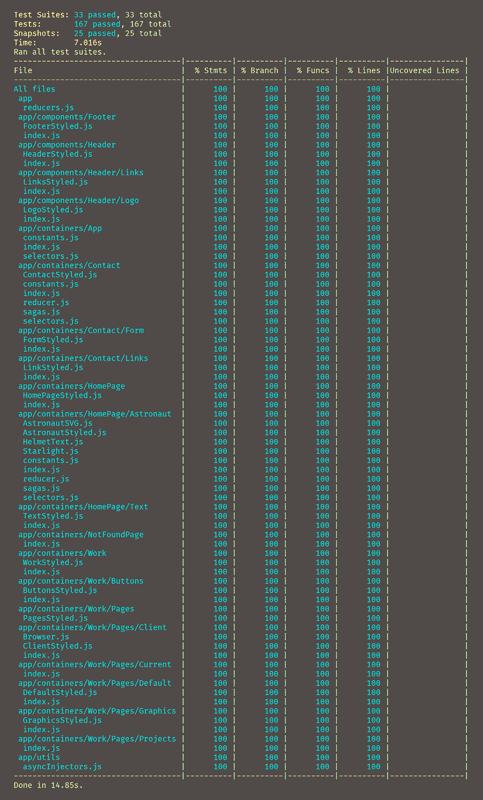

# Joe's React Website 
An [example website](https://www.joeireland.com) built with React and tons of other great stuff

## Motivation
Often developers want to know the proper way to structure their applications, and poll users for their favorite tech stack. This project aims to provide an answer to those questions through example.

## Prerequisites

For this example to be of use to you, you should have a basic understanding of
  * React
  * ES6
  * JSX

If you're new to React I highly recommend you check out Mark Erikson's excellent list of [resources](https://github.com/markerikson/react-redux-links/) and then come back.

## Features

<dl>
  <dt>Scalable Architecture</dt>
  <dd>Organizing by feature instead of type means as the application grows you won't have to search through hundreds of files to find the one you're looking for. Additionally you'll have the added benefit of easier debugging.</dd>

  <dt>Immutable State</dt>
  <dd>Creates state predictability and eliminates the unwanted side effects and headaches of mutable data.</dd>

  <dt>Bleeding-edge JavaScript</dt>
  <dd>Classes, template literals, destructuring assignments, generator functions, all that fun stuff.</dd>

  <dt>Composable CSS</dt>
  <dd>The styles are located next to the components but not in them; separating logic and styles while increasing readability. Only the styles for the current component are loaded for optimal performance.</dd>

  <dt>Code Splitting</dt>
  <dd>Not only the css but also the javascipt, images, and html of the current path are loaded decreasing page rendering time and saving bandwith on the client side.</dd>

  <dt>Offline-first</dt>
  <dd>Load the app once and from then on a service worker will load the page in case an internet connection isn't available.</dd>

  <dt>SEO</dt>
  <dd>Head tag management, structured data / rich snippets, everything a search engine wants and needs.</dd>

  <dt>Battle Tested</dt>
  <dd>My web app currently has 100% test coverage as all good apps should.</dd>
</dl>

## Built With

* [React](https://github.com/facebook/react)
* [React Redux](https://github.com/reactjs/react-redux) - State Management
* [Redux Saga](https://github.com/redux-saga/redux-saga) - Async State Management
* [React Router](https://github.com/ReactTraining/react-router) - Page Routing
* [Styled Components](https://github.com/styled-components/styled-components) - Everything CSS
* [Reselect](https://github.com/reactjs/reselect) - Memoization
* [React Helmet](https://github.com/nfl/react-helmet) - SEO
* [Webpack](https://github.com/webpack/webpack) - Building, Dev Server, Hot-Reloading, Code-Splitting
* [React Transition Group](https://github.com/reactjs/react-transition-group) - Animation
* [Immutable](https://github.com/facebook/immutable-js) - Immutable Data Structures
* [Font Face Observer](https://github.com/bramstein/fontfaceobserver) - Font Loader (Prevents FOIT)

## Tests

## Author

**Joseph Ireland** - [Website](https://www.joeireland.com)
